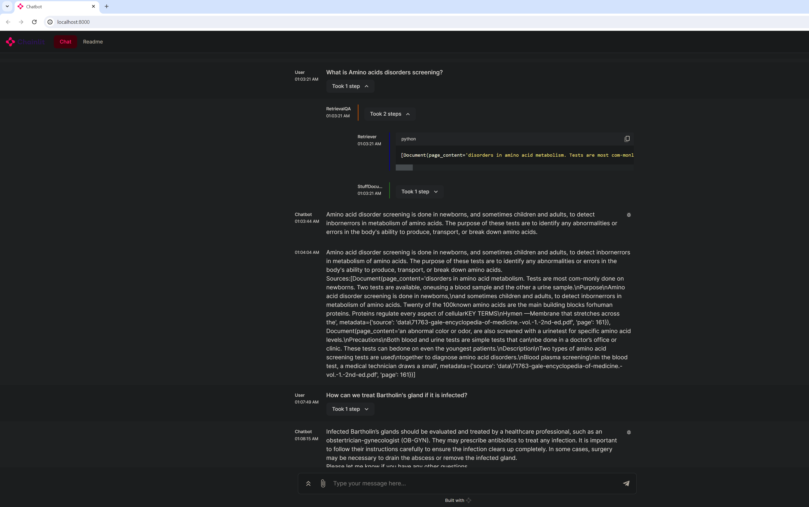
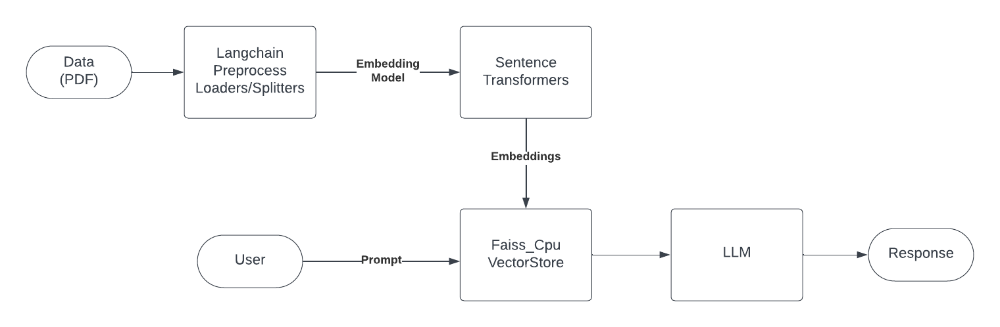

# Large Language Models

Small applications using large language models

## Medical Chatbot

Use LLama 2 model with a ~ 600 pages medical pdf document to answer medical related questions and provide sources. Uses only open source models and libraries and runs on local machine.



Source: [Build and Run a Medical Chatbot using Llama 2 on CPU Machine: All Open Source](https://www.youtube.com/watch?v=kXuHxI5ZcG0)

Using: 
- [LLama2](https://ai.meta.com/llama/) - open source Meta LLM, 
- [CTransformers](https://github.com/marella/ctransformers) - python binding for transformers,
- [Sentance Transformers (all-MiniLM-L6-v2)](https://huggingface.co/sentence-transformers/all-MiniLM-L6-v2) - to extract embeddings, 
- [Faiss CPU](https://github.com/facebookresearch/faiss) - vector store to store embeddings, 
- [Langchain](https://python.langchain.com/docs/get_started/introduction.html) - an orchestrator for language models,
- [Chainlit](https://github.com/Chainlit/chainlit) - a Chat like UI framework

Setup
- Download the [LLama2 7B (Quantized) model](https://huggingface.co/TheBloke/Llama-2-7B-Chat-GGML/blob/main/llama-2-7b-chat.ggmlv3.q8_0.bin)
```
python -m venv venv
venv\Scripts\activate
pip install -r requirements.txt
python ingest.py # this will load the pdf document into the vector store
chainlit run model.py -w
```

Notes:
- quantized models are optimized to use CPU
- vector stores allows efficient similarity search in a fast way

Architecture


