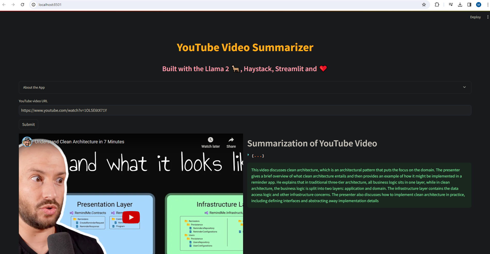
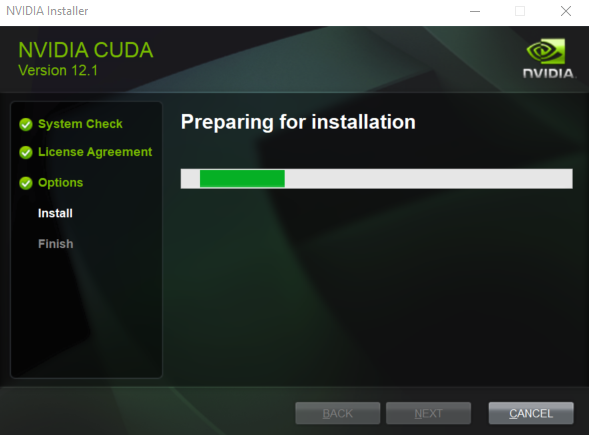
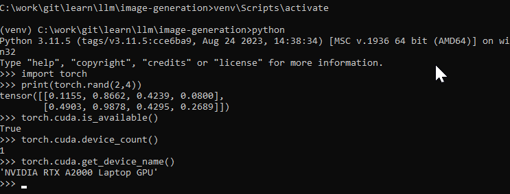

# Large Language Models

Small applications using large language models.
Note: samples were run on a Windows 10 OS. The setup instructions can be easily adapted to othe OSes.

## Medical Chatbot

Use LLama 2 model with a ~ 600 pages medical pdf document to answer medical related questions and provide sources. Uses only open source models and libraries and runs on local machine.


Source: [Build and Run a Medical Chatbot using Llama 2 on CPU Machine: All Open Source](https://www.youtube.com/watch?v=kXuHxI5ZcG0)

Using: 
- [LLama2](https://ai.meta.com/llama/) - open source Meta LLM
- [CTransformers](https://github.com/marella/ctransformers) - python binding for transformers
- [Sentance Transformers (all-MiniLM-L6-v2)](https://huggingface.co/sentence-transformers/all-MiniLM-L6-v2) - to extract embeddings
- [Faiss CPU](https://github.com/facebookresearch/faiss) - vector store to store embeddings
- [Langchain](https://python.langchain.com/docs/get_started/introduction.html) - an orchestrator for language models
- [Chainlit](https://github.com/Chainlit/chainlit) - a Chat like UI framework

Setup
- Download the [llama-2-7b-chat.ggmlv3.q8_0.bin](https://huggingface.co/TheBloke/Llama-2-7B-Chat-GGML/blob/main/llama-2-7b-chat.ggmlv3.q8_0.bin)
```
python -m venv venv
venv\Scripts\activate
pip install -r requirements.txt
python ingest.py # this will load the pdf document into the vector store
chainlit run model.py -w
```

Notes:
- quantized models are optimized to use CPU
- vector stores allows efficient similarity search in a fast way

Architecture


## Youtube Summary

Youtube summarization app leveraging local Whisper to get text from audio and then use LLama2 to summarize the transcript. Uses only open source models and libraries and runs on local machine.
It takes ~ 2 minutes to generate a summary for a ~ 4 min video.




Source: [Build Your Own YouTube Video Summarization App with Haystack, Llama 2, Whisper, and Streamlit](https://www.youtube.com/watch?v=K9mDAb2Lz6Y)

Using:
- [llama.cpp](https://github.com/ggerganov/llama.cpp) - port of LLama model to C/C++ with quantization support Based on [ggml](https://github.com/ggerganov/ggml) which allows to run models on CPU.
- [llama-cpp-python](https://github.com/abetlen/llama-cpp-python) - python binding for llama.cpp
- [LLaMA-2-7B-32K](https://huggingface.co/togethercomputer/LLaMA-2-7B-32K) - fine tuned LLama2 model for a context length of 32k for long text summarization
- [haystack](https://github.com/deepset-ai/haystack) - LLM orchestration framework to build customizable, production-ready LLM applications. Connect components (models, vector DBs, file converters) to pipelines or agents that can interact with your data.
- [whisper](https://github.com/openai/whisper) - robust Speech Recognition via Large-Scale Weak Supervision
- [streamlit](https://github.com/streamlit/streamlit) - build webapps in minutes

Setup
- download [llama-2-7b-32k-instruct.Q4_K_S.gguf](https://huggingface.co/TheBloke/Llama-2-7B-32K-Instruct-GGUF/resolve/main/llama-2-7b-32k-instruct.Q4_K_S.gguf?download=true)
- install ffmpeg from [here](https://ffmpeg.org/download.html) and add it to PATH env variable. Alternatively it can be installed with choco. This is needed for Whisper.

```
python -m venv venv
venv\Scripts\activate
pip install -r requirements.txt
streamlit run yt_summary.py
```

## Image generation

Text to image generation app using Open AI's DALL-E and open source HuggingFace Diffusers.


Source: [AI Image Generation Streamlit App](https://www.youtube.com/watch?v=17oHPkhgCuk)

Using:
- [streamlit](https://github.com/streamlit/streamlit) - build webapps in minutes
- [HuggingFace Diffusers](https://github.com/huggingface/diffusers) - state-of-the-art diffusion models for image and audio generation in PyTorch
- [OpenAI DALL-E](https://openai.com/dall-e-2) and [OpenAI Python Library](https://github.com/openai/openai-python)

Setup:

- go to [Pytorch website](https://pytorch.org/) and select the combo specific to your system. The command generated will be used the next steps.


- go to [NVidia CUDA Toolkit download page](https://developer.nvidia.com/cuda-toolkit-archive) and download the version of cuda, you selected above. Install it.


- check cuda was installed by running this command
```
nvcc --version
```

```
python -m venv venv
venv\Scripts\activate
pip install -r requirements.txt
pip uninstall torch
pip install torch torchvision torchaudio --index-url https://download.pytorch.org/whl/cu121
streamlit run image_gen.py
```

- double check that torch and cuda are working as expected

