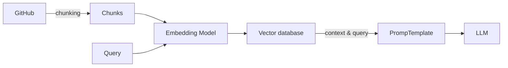

## Chat with your code using RAG

Source: [Chat with your code using RAG!](https://lightning.ai/lightning-ai/studios/chat-with-your-code-using-rag?section=featured&tab=overview)

Using: 
- [LlamaIndex](https://github.com/run-llama/llama_index) - a data framework for your LLM applications. Offers data connectors, retrieval/query over your data, etc
- [Ollama](https://github.com/ollama/ollama) - run llm locally

Setup

```
ollama run qwen2.5:14b-instruct-q4_1
```

```
python -m venv venv
venv\Scripts\activate
pip install -r requirements.txt
python app.py
```

Architecture
