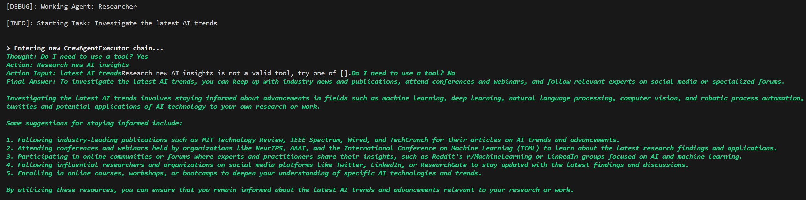
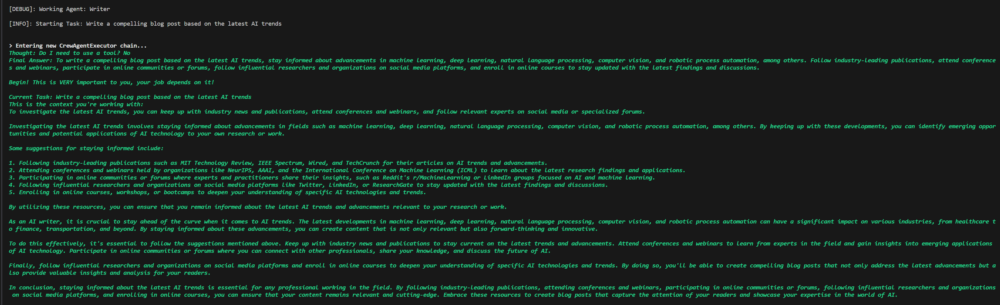

# CrewAI

AI researcher and an AI blog writer agents working to create an AI trends blogpost. Uses __ollama__ to run openhermes model locally and __crewai__ to orchestrate the agents.




Source: [CrewAI Tutorial - Next Generation AI Agent Teams (Fully Local)](https://www.youtube.com/watch?v=tnejrr-0a94)

Using

- [CrewAI](https://github.com/joaomdmoura/crewAI) - Framework for orchestrating role-playing, autonomous AI agents. By fostering collaborative intelligence, CrewAI empowers agents to work together seamlessly, tackling complex tasks.
- [ollama](https://github.com/jmorganca/ollama) - Get up and running with Llama 2, Mistral, and other large language models locally.

Setup 

- in a terminal, run ollama (CPU only). Ollama does not have a version for Windows currently, so we run it as docker container
```
docker run -d -v ollama:/root/.ollama -p 11434:11434 --name ollama ollama/ollama
docker exec -it ollama ollama run openhermes
```

- in another terminal, run the app:
```
python -m venv venv
venv\Scripts\activate
pip install -r requirements.txt
python aitrends.py
```
