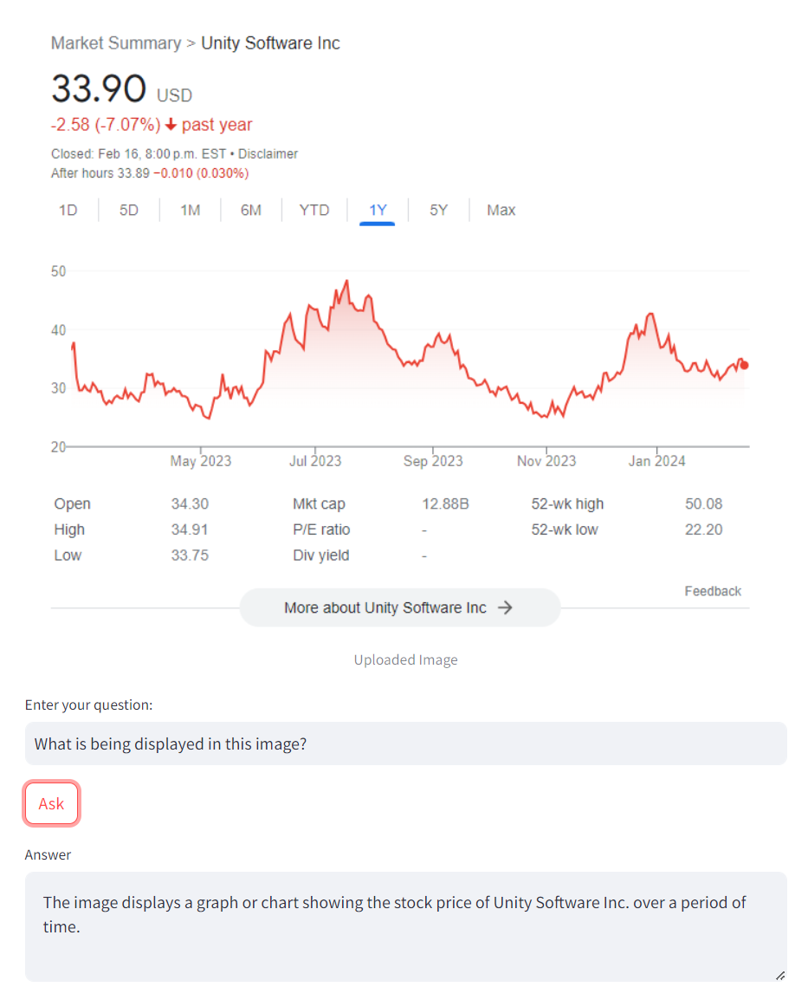
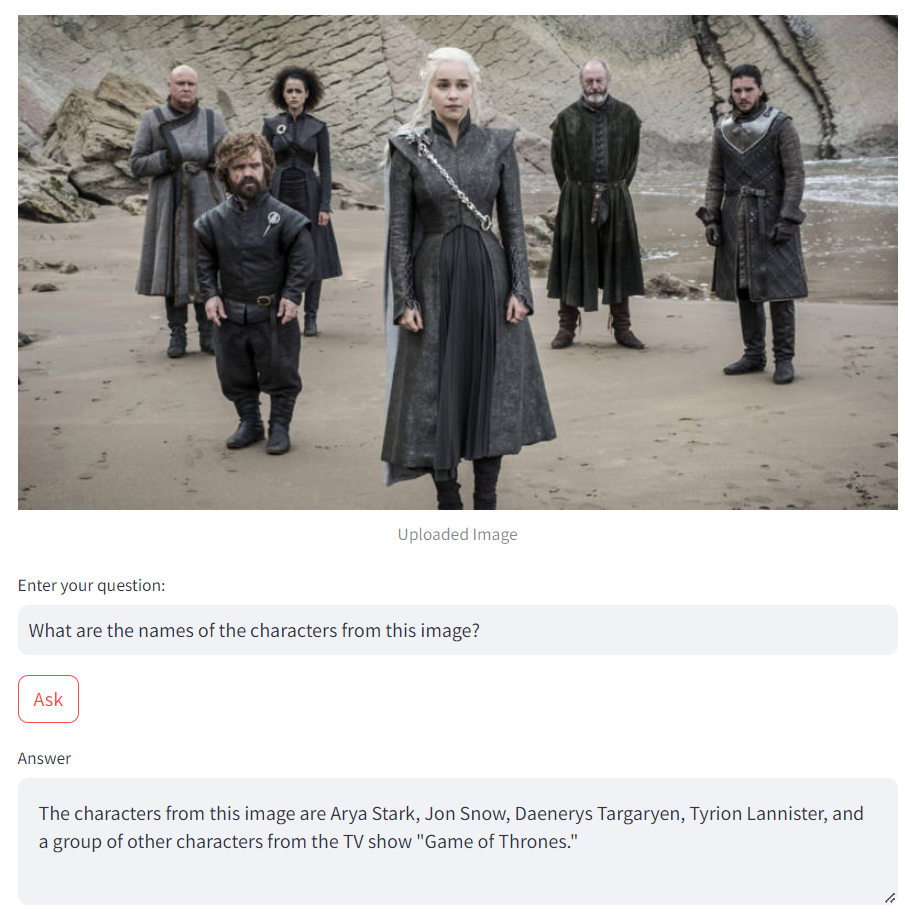

## Image analyzer

Image analyzer with [Imp-V1-3B](https://huggingface.co/MILVLG/imp-v1-3b) MSLM (multimodal small language model), crafted by integrating a compact yet formidable small language model, [Phi-2](https://huggingface.co/microsoft/phi-2), and an advanced visual encoder, [SigLIP](https://huggingface.co/google/siglip-base-patch16-384).
It provides similar performance to the much larger LLaVA-7B model.

<p float="left">
  
   
</p>

<p float="left">
  
  
</p>


Source: [Imp-V1-3B: How a Tiny Model is Beating Giants in Multimodal LLM Space](https://www.youtube.com/watch?v=XPCIH1MkcCU)

Using:
- [streamlit](https://github.com/streamlit/streamlit) - build webapps in minutes
- [Imp-V1-3B](https://huggingface.co/MILVLG/imp-v1-3b) - multimodal small language model

Setup

- go to [Pytorch website](https://pytorch.org/) and select the combo specific to your system. The command generated helped in the setup of requirements.txt.


- go to [NVidia CUDA Toolkit download page](https://developer.nvidia.com/cuda-toolkit-archive) and download the version of cuda, you selected above. Install it.


- check cuda was installed by running this command
```
nvcc --version
```

```
python -m venv venv
venv\Scripts\activate
pip install -r requirements.txt
streamlit run image-analyzer.py
```
