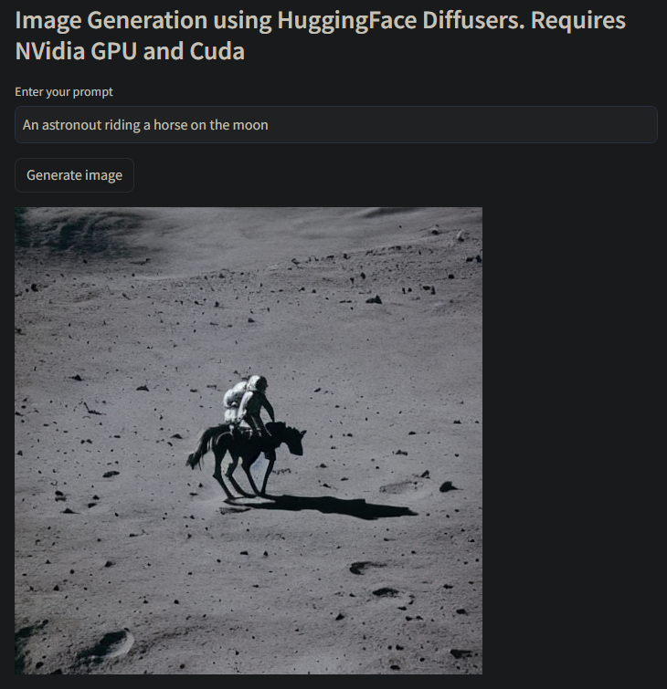
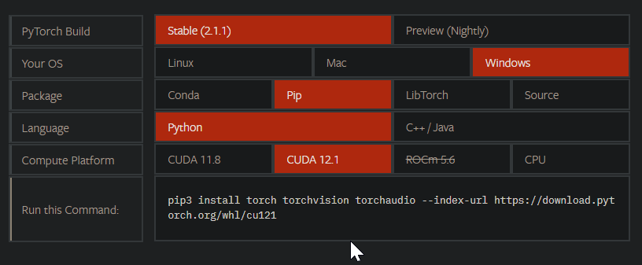
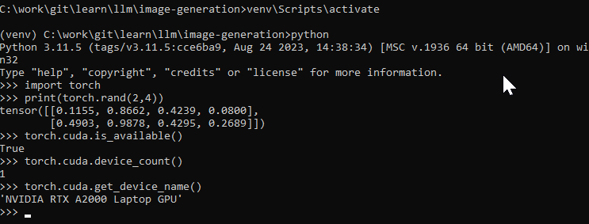

## Image generation

Text to image generation app using Open AI's DALL-E and open source HuggingFace Diffusers.
HuggingFace Diffusers require an NVIDIA GPU with Cuda and pytorch compiled with Cuda.



Source: [AI Image Generation Streamlit App](https://www.youtube.com/watch?v=17oHPkhgCuk)

Using:
- [streamlit](https://github.com/streamlit/streamlit) - build webapps in minutes
- [SDXL Turbo](https://huggingface.co/stabilityai/sdxl-turbo)
- [HuggingFace Diffusers](https://github.com/huggingface/diffusers) - state-of-the-art diffusion models for image and audio generation in PyTorch
- [OpenAI DALL-E](https://openai.com/dall-e-2) and [OpenAI Python Library](https://github.com/openai/openai-python)

Setup:

- create `.env` file and set the OpenAPI key and HuggingFace Token
```
OPEN_API_KEY=INSERT_KEY_HERE
HF_TOKEN=INSERT_TOKEN_HERE
```
- go to [Pytorch website](https://pytorch.org/) and select the combo specific to your system. Run the command.


- go to [NVidia CUDA Toolkit download page](https://developer.nvidia.com/cuda-toolkit-archive) and download the version of cuda, you selected above. Install it.


- check cuda was installed by running this command
```
nvcc --version
```

```
python -m venv venv
venv\Scripts\activate
pip install -r requirements.txt
streamlit run image_gen.py
```

- double check that torch and cuda are working as expected

