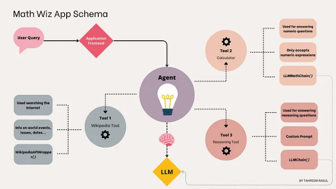

## Math Wizz

A tutorial on why LLMs struggle with math, and how to resolve these limitations using LangChain Agents, OpenAI and Chainlit. MathWizz Agent will use Wikipedia Tool, Calculator Tool and Reasoning Tool.

Architecture:



Application flow:


Results:


Source: [Building a Math Application with LangChain Agents](https://towardsdatascience.com/building-a-math-application-with-langchain-agents-23919d09a4d3)

Using:
- [Chainlit](https://github.com/Chainlit/chainlit) - build conversational AI in minutes
- [Langchain](https://github.com/langchain-ai/langchain) - build context-aware reasoning applications
- [OpenAI](https://openai.com/)

Setup

- create .env file and set OpenAI Api key
```
OPENAI_API_KEY='KEY_HERE'
```

- activate virtual env, install dependencies and run app

```
python -m venv venv
venv\Scripts\activate
pip install -r requirements.txt
chainlit run chatbot.py
```
