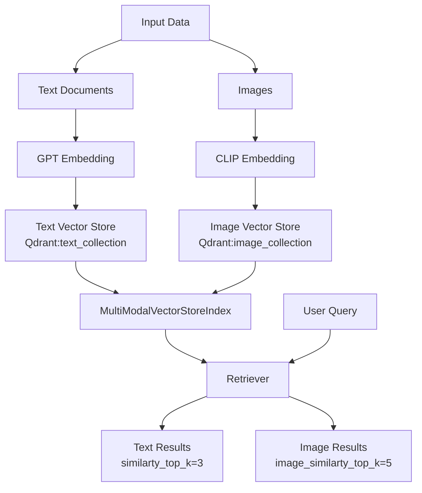

## Multimodal RAG

Source: [Multi-modal RAG: Chat with Docs containing Images](https://www.youtube.com/watch?v=Rg35oYuus-w)

Using: 
- [LlamaIndex](https://github.com/run-llama/llama_index) - a data framework for your LLM applications. Offers data connectors, retrieval/query over your data, etc
- [CLIP](https://github.com/openai/CLIP) - (Contrastive Language-Image Pretraining), Predict the most relevant text snippet given an image

Setup

- create .env file and set OpenAI Api key
```
OPENAI_API_KEY='KEY_HERE'
```

- activate virtual env, install dependencies
```
python -m venv venv
venv\Scripts\activate
pip install -r requirements.txt
```

Architecture
