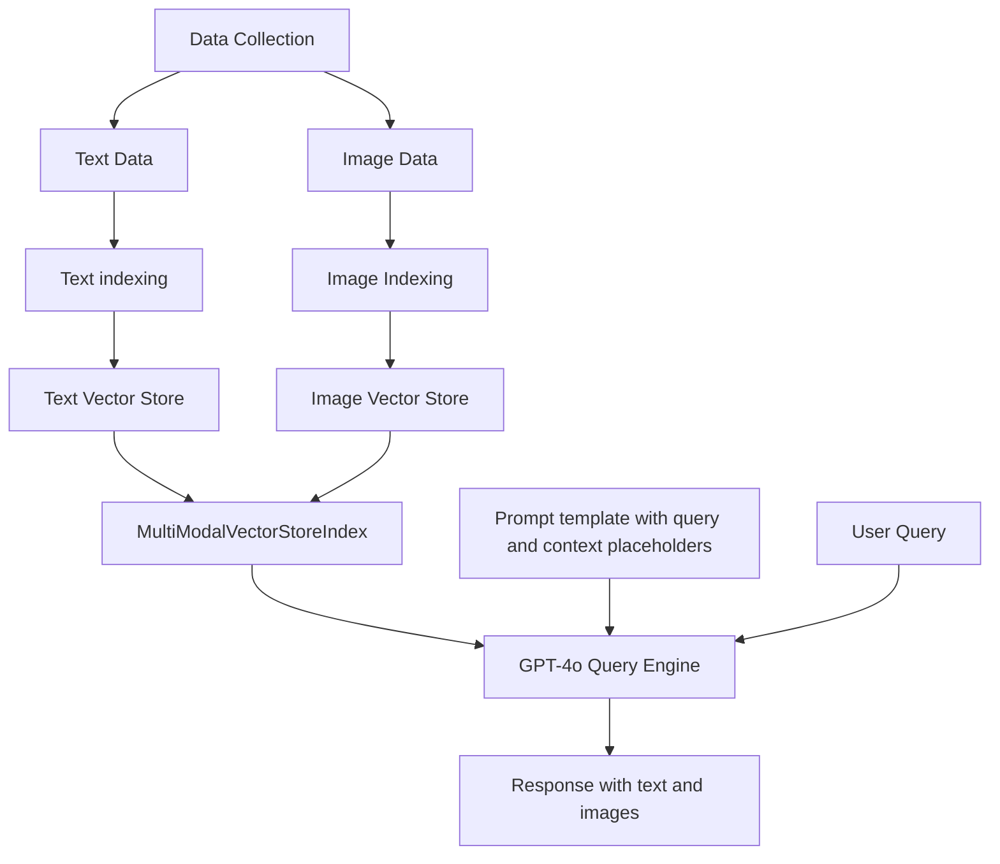

## Multimodal RAG - Retrieval and Response Generation with GPT4

Multimodal Retrieval-Augmented Generation (RAG) is an advanced technique that combines text and image data to enhance the capabilities of large language models (LLMs) like GPT-4. 
This tutorial will guide you through the process of implementing a multimodal RAG system using GPT-4 and LlamaIndex.

Multimodal RAG extends traditional text-based RAG by incorporating image data:

- Indexing: Both text and images are processed and stored in separate vector stores.
- Retrieval: When a query is received, relevant text and images are retrieved based on similarity.
- Augmentation: The retrieved information is used to augment the input to the LLM.
- Generation: The LLM generates a response based on the augmented input.

Source: [Multi-Modal RAG: Chat with Text and Images in Documents](https://www.youtube.com/watch?v=EwtoG-f1mLk)

Using: 
- [LlamaIndex](https://github.com/run-llama/llama_index) - a data framework for your LLM applications. Offers data connectors, retrieval/query over your data, etc
- [CLIP](https://github.com/openai/CLIP) - (Contrastive Language-Image Pretraining), Predict the most relevant text snippet given an image

Setup

- create .env file and set OpenAI Api key
```
OPENAI_API_KEY='KEY_HERE'
```

- activate virtual env, install dependencies
```
python -m venv venv
venv\Scripts\activate
pip install -r requirements.txt
```

Architecture
