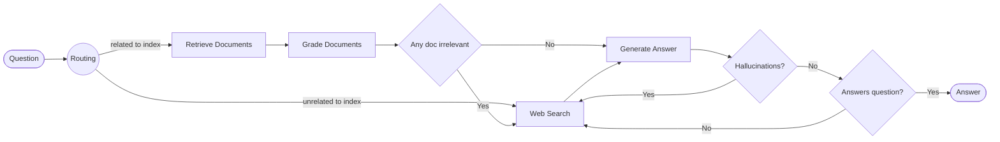

## RAG Agent
This tutorial combines different ideas like:
- __routing__(adaptive rag) to route questions to different retrieval approaches
- __fallback__(corrective rag) to fallback to web search if docs are not relevant
- __self-correction__(self rag) to fix answers with halucinations or don't address the question

Source: [Reliable, fully local RAG agents with LLaMA3.2-3b](https://www.youtube.com/watch?v=bq1Plo2RhYI)

Using: 
- [Nomic Embeddings](https://www.nomic.ai/blog/posts/nomic-embed-text-v1)
- [Ollama](https://github.com/ollama/ollama) - run llm locally
- [Tavily](https://tavily.com) - web search optimized for LLM and Rag
- [LangGraph](https://langchain-ai.github.io/langgraph/) - a library for building stateful, multi-actor applications with LLMs, used to create agent and multi-agent workflows

Setup

```
ollama run llama3.2:3b-instruct-fp16
```

```
python -m venv venv
venv\Scripts\activate
pip install -r requirements.txt
```

Architecture
