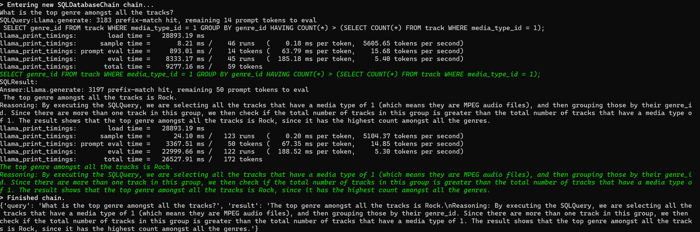

# Text2SQL

Ask questions to a chatbot related to data stored in a Postgres database.



Using
- LLama2
- Postgres
- Langchain

Setup 

- Download [llama-2-7b-chat.Q5_K_M.gguf](https://huggingface.co/TheBloke/Llama-2-7B-Chat-GGUF/resolve/main/llama-2-7b-chat.Q5_K_M.gguf)
- install Postgres
- download [sql script](https://github.com/lerocha/chinook-database/blob/master/ChinookDatabase/DataSources/Chinook_PostgreSql.sql) for Chinook database
- run script to create and seed database ```psql -h localhost -U postgres -f Chinook_PostgreSql.sql```

```
python -m venv venv
venv\Scripts\activate
pip install -r requirements.txt
python main.py
```
