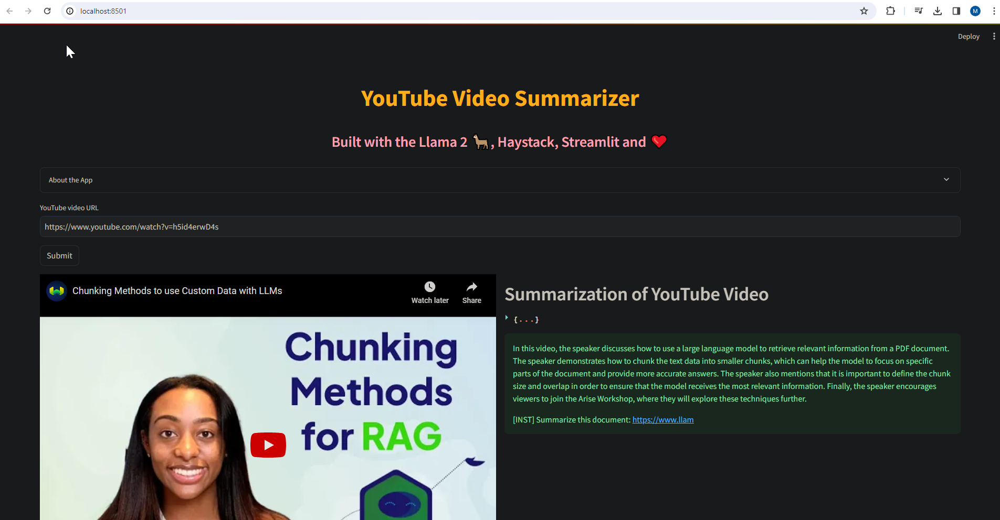
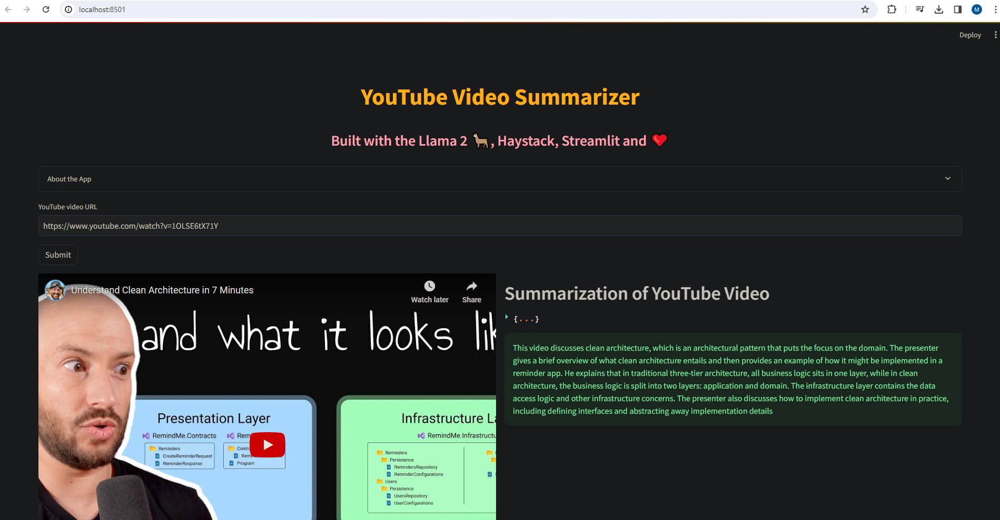

## Youtube Summary

Youtube summarization app leveraging local Whisper to get text from audio and then use LLama2 to summarize the transcript. Uses only open source models and libraries and runs on local machine.
It takes ~ 2 minutes to generate a summary for a ~ 4 min video.




Source: [Build Your Own YouTube Video Summarization App with Haystack, Llama 2, Whisper, and Streamlit](https://www.youtube.com/watch?v=K9mDAb2Lz6Y)

Using:
- [llama.cpp](https://github.com/ggerganov/llama.cpp) - port of LLama model to C/C++ with quantization support Based on [ggml](https://github.com/ggerganov/ggml) which allows to run models on CPU.
- [llama-cpp-python](https://github.com/abetlen/llama-cpp-python) - python binding for llama.cpp
- [LLaMA-2-7B-32K](https://huggingface.co/togethercomputer/LLaMA-2-7B-32K) - fine tuned LLama2 model for a context length of 32k for long text summarization
- [haystack](https://github.com/deepset-ai/haystack) - LLM orchestration framework to build customizable, production-ready LLM applications. Connect components (models, vector DBs, file converters) to pipelines or agents that can interact with your data.
- [whisper](https://github.com/openai/whisper) - robust Speech Recognition via Large-Scale Weak Supervision
- [streamlit](https://github.com/streamlit/streamlit) - build webapps in minutes

Setup
- download [llama-2-7b-32k-instruct.Q4_K_S.gguf](https://huggingface.co/TheBloke/Llama-2-7B-32K-Instruct-GGUF/resolve/main/llama-2-7b-32k-instruct.Q4_K_S.gguf?download=true)
- install ffmpeg from [here](https://ffmpeg.org/download.html) and add it to PATH env variable. Alternatively it can be installed with choco. This is needed for Whisper.

```
python -m venv venv
venv\Scripts\activate
pip install -r requirements.txt
streamlit run yt_summary.py
```
